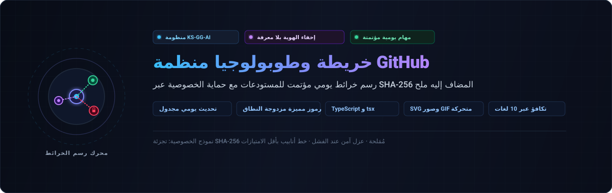

<div align="center">

<p>
  
</p>

# github-org-map

<p>
  <strong>تخطيط طوبولوجي يومي مؤتمت لمستودعات KS-SSS-AI مع إخفاء أمني قائم على تشفير SHA-256 خالي من المعرفة</strong>
</p>

<p>
  <a href="../../README.md">🇺🇸 English</a> · <a href="./ko.md">🇰🇷 한국어</a> · <a href="./zh-CN.md">🇨🇳 中文</a> · <a href="./es.md">🇪🇸 Español</a> · <a href="./hi.md">🇮🇳 हिन्दी</a><br />
  <strong>🇸🇦 العربية</strong> · <a href="./pt-BR.md">🇧🇷 Português</a> · <a href="./ru.md">🇷🇺 Русский</a> · <a href="./fr.md">🇫🇷 Français</a> · <a href="./id.md">🇮🇩 Bahasa Indonesia</a>
</p>

<p>
  <a href="https://github.com/KS-SSS-AI/github-org-map/releases"></a>
  <a href="../../LICENSE"></a>
  
  
  
</p>

<p align="center">
  
</p>

</div>

---

<details>
<summary><h2 style="display:inline-block; margin:0;">حول المشروع</h2></summary>

خريطة محدثة يوميًا للمستودعات التابعة لحساب KS-SSS-AI ومنظمة KS-SSS-AI. تظهر المستودعات العامة بأسمائها الحقيقية؛ بينما تظهر المستودعات الخاصة كتسميات مقنعة بأمان، ويتم حفظ السجل في `history/` ودمجه في صورة GIF متحركة.

</details>

---

<details>
<summary><h2 style="display:inline-block; margin:0;">آلية العمل</h2></summary>

يقوم هذا المستودع بإنشاء الخريطة تلقائيًا: لقطة SVG لليوم، وسجل تاريخي مؤرخ، وصورة GIF متحركة تعرض تطور البنية مع الوقت.

</details>

---

<details>
<summary><h2 style="display:inline-block; margin:0;">الأسرار المطلوبة (Secrets)</h2></summary>

يتطلب سير العمل 3 أسرار: `USER_READ_TOKEN` و `ORG_READ_TOKEN` و `MASK_SALT`.

</details>

---

<details>
<summary><h2 style="display:inline-block; margin:0;">الجدول الزمني ومسار العمل</h2></summary>

يعمل `.github/workflows/refresh.yml` وفق جدول يومي دقيق مع فصل كامل بين صلاحيات القراءة والدفع.

</details>

---

<details>
<summary><h2 style="display:inline-block; margin:0;">التشغيل المحلي</h2></summary>

```sh
npm install
USER_READ_TOKEN=ghp_xxx ORG_READ_TOKEN=ghp_yyy MASK_SALT=<the salt> npm run generate
```

</details>

---

<details>
<summary><h2 style="display:inline-block; margin:0;">الإعدادات</h2></summary>

قم بتعديل `data/config.json` لتخصيص الحسابات والمنظمات والمنطقة الزمنية ومعدل إطارات GIF.

</details>

---

<details>
<summary><h2 style="display:inline-block; margin:0;">الاختبارات</h2></summary>

```sh
npm test
```

</details>

---

<details>
<summary><h2 style="display:inline-block; margin:0;">التواصل والدعم</h2></summary>

لأي استفسارات أو ملاحظات، يُرجى استخدام الروابط الرسمية أدناه.

[GitHub 프로필](https://github.com/KS-SSS-AI) · [프로필 저장소](https://github.com/KS-SSS-AI/KS-SSS-AI) · [이슈 등록](https://github.com/KS-SSS-AI/KS-SSS-AI/issues/new)

</details>

---

<details>
<summary><h2 style="display:inline-block; margin:0;">📬 للتواصل</h2></summary>

للعمل العام، الملاحظات، أو إلقاء نظرة فاحصة على التنفيذ، هذه هي أوضح نقاط البداية.

[الملف الشخصي على GitHub](https://github.com/KS-SSS-AI) · [المستودعات العامة](https://github.com/KS-SSS-AI?tab=repositories) · [فتح مشكلة](https://github.com/KS-SSS-AI/github-org-map/issues/new) · [مصدر الملف الشخصي](https://github.com/KS-SSS-AI/KS-SSS-AI)

</details>
