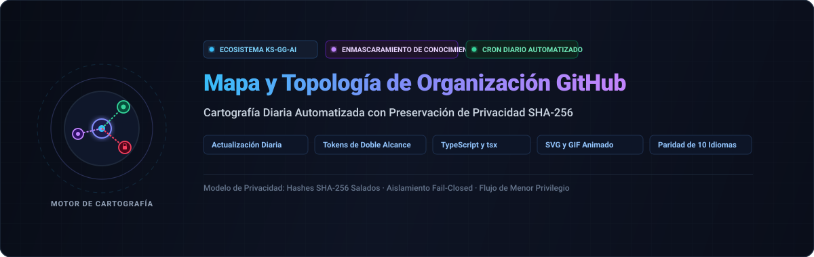

<div align="center">

<p>
  
</p>

# github-org-map

<p>
  <strong>Mapeo y cartografía topológica diaria de repositorios KS-SSS-AI con preservación de privacidad SHA-256 de conocimiento cero</strong>
</p>

<p>
  <a href="../../README.md">🇺🇸 English</a> · <a href="./ko.md">🇰🇷 한국어</a> · <a href="./zh-CN.md">🇨🇳 中文</a> · <strong>🇪🇸 Español</strong> · <a href="./hi.md">🇮🇳 हिन्दी</a><br />
  <a href="./ar.md">🇸🇦 العربية</a> · <a href="./pt-BR.md">🇧🇷 Português</a> · <a href="./ru.md">🇷🇺 Русский</a> · <a href="./fr.md">🇫🇷 Français</a> · <a href="./id.md">🇮🇩 Bahasa Indonesia</a>
</p>

<p>
  <a href="https://github.com/KS-SSS-AI/github-org-map/releases"></a>
  <a href="../../LICENSE"></a>
  
  
  
</p>

<p align="center">
  
</p>

</div>

---

<details>
<summary><h2 style="display:inline-block; margin:0;">Acerca de</h2></summary>

Un mapa actualizado diariamente de los repositorios pertenecientes a la cuenta KS-SSS-AI y a la organización KS-SSS-AI. Los repositorios públicos se muestran con sus nombres reales; los repositorios privados aparecen enmascarados mediante hash SHA-256 con sal, y algunos repositorios internos se omiten por completo. Cada instantánea se archiva en `history/` y se compila en un GIF animado.

</details>

---

<details>
<summary><h2 style="display:inline-block; margin:0;">Cómo funciona</h2></summary>

Este repositorio genera el mapa automáticamente cada día:
- **Instantánea SVG de hoy**: Diagrama vectorial con estilo chasis oscuro de alto rendimiento.
- **Historial fechado**: Archivo cronológico guardado en `history/<date>.svg`.
- **Línea de tiempo GIF animada**: Compilación secuencial `org-map.gif` que muestra la evolución histórica.

</details>

---

<details>
<summary><h2 style="display:inline-block; margin:0;">Secretos requeridos</h2></summary>

Un token de acceso personal de grano fino está restringido a un único propietario, por lo que se requieren tres secretos:
- `USER_READ_TOKEN`: Acceso a la cuenta personal (Metadatos de solo lectura).
- `ORG_READ_TOKEN`: Acceso a la organización rastreada.
- `MASK_SALT`: Cadena aleatoria secreta para salar los hashes de enmascaramiento.

</details>

---

<details>
<summary><h2 style="display:inline-block; margin:0;">Programación del flujo de trabajo</h2></summary>

`.github/workflows/refresh.yml` se ejecuta diariamente y bajo demanda mediante `workflow_dispatch`, dividido en dos trabajos aislados: generación segura y confirmación sin secretos.

</details>

---

<details>
<summary><h2 style="display:inline-block; margin:0;">Ejecución local</h2></summary>

```sh
npm install
USER_READ_TOKEN=ghp_xxx ORG_READ_TOKEN=ghp_yyy MASK_SALT=<the salt> npm run generate
```

</details>

---

<details>
<summary><h2 style="display:inline-block; margin:0;">Configuración</h2></summary>

Modifique `data/config.json` para cambiar cuentas, organizaciones, zonas horarias o parámetros de animación GIF.

</details>

---

<details>
<summary><h2 style="display:inline-block; margin:0;">Pruebas</h2></summary>

```sh
npm test
```

</details>

---

<details>
<summary><h2 style="display:inline-block; margin:0;">📬 Contacto</h2></summary>

Para trabajo público, comentarios o un vistazo más de cerca a la implementación, estos son los puntos de partida más claros.

[Perfil de GitHub](https://github.com/KS-SSS-AI) · [Repositorios públicos](https://github.com/KS-SSS-AI?tab=repositories) · [Abrir una incidencia](https://github.com/KS-SSS-AI/github-org-map/issues/new) · [Fuente del perfil](https://github.com/KS-SSS-AI/KS-SSS-AI)

</details>
