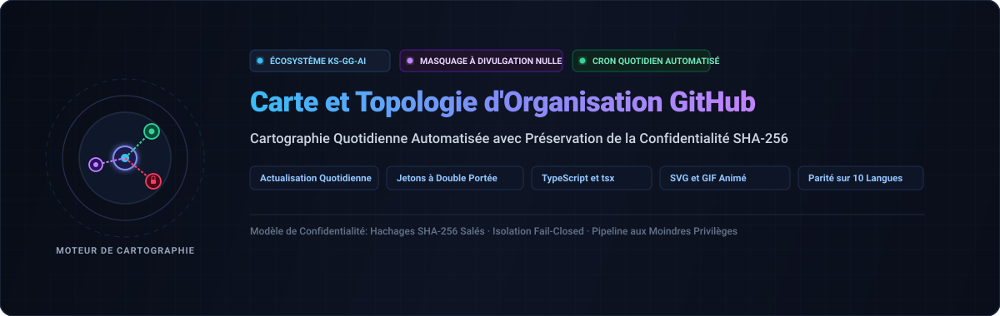

<div align="center">

<p>
  
</p>

# github-org-map

<p>
  <strong>Cartographie quotidienne automatisée des dépôts KS-SSS-AI avec masquage de confidentialité SHA-256 à divulgation nulle de connaissance</strong>
</p>

<p>
  <a href="../../README.md">🇺🇸 English</a> · <a href="./ko.md">🇰🇷 한국어</a> · <a href="./zh-CN.md">🇨🇳 中文</a> · <a href="./es.md">🇪🇸 Español</a> · <a href="./hi.md">🇮🇳 हिन्दी</a><br />
  <a href="./ar.md">🇸🇦 العربية</a> · <a href="./pt-BR.md">🇧🇷 Português</a> · <a href="./ru.md">🇷🇺 Русский</a> · <strong>🇫🇷 Français</strong> · <a href="./id.md">🇮🇩 Bahasa Indonesia</a>
</p>

<p>
  <a href="https://github.com/KS-SSS-AI/github-org-map/releases"></a>
  <a href="../../LICENSE"></a>
  
  
  
</p>

<p align="center">
  
</p>

</div>

---

<details>
<summary><h2 style="display:inline-block; margin:0;">À propos</h2></summary>

Une carte actualisée quotidiennement des dépôts appartenant au compte KS-SSS-AI et à l'organisation KS-SSS-AI. Les dépôts publics apparaissent sous leurs vrais noms ; les dépôts privés sont masqués avec un hachage SHA-256 salé sécurisé. Les instantanés sont archivés dans `history/` et assemblés dans un GIF animé.

</details>

---

<details>
<summary><h2 style="display:inline-block; margin:0;">Fonctionnement</h2></summary>

Ce dépôt produit automatiquement la carte : instantané SVG du jour, historique archivé et GIF animé dynamique.

</details>

---

<details>
<summary><h2 style="display:inline-block; margin:0;">Secrets requis</h2></summary>

Configuration sécurisée avec `USER_READ_TOKEN`, `ORG_READ_TOKEN` et `MASK_SALT`.

</details>

---

<details>
<summary><h2 style="display:inline-block; margin:0;">Planification du flux de travail</h2></summary>

Exécution quotidienne avec séparation stricte des privilèges entre la génération et la publication.

</details>

---

<details>
<summary><h2 style="display:inline-block; margin:0;">Exécution locale</h2></summary>

```sh
npm install
USER_READ_TOKEN=ghp_xxx ORG_READ_TOKEN=ghp_yyy MASK_SALT=<the salt> npm run generate
```

</details>

---

<details>
<summary><h2 style="display:inline-block; margin:0;">Configuration</h2></summary>

Modifiez `data/config.json` pour ajuster les comptes suivis, le fuseau horaire et les paramètres du GIF.

</details>

---

<details>
<summary><h2 style="display:inline-block; margin:0;">Tests</h2></summary>

```sh
npm test
```

</details>

---

<details>
<summary><h2 style="display:inline-block; margin:0;">📬 Contact</h2></summary>

Pour les travaux publics, les retours ou un examen plus approfondi de l'implémentation, voici les points d'entrée les plus clairs.

[Profil GitHub](https://github.com/KS-SSS-AI) · [Dépôts publics](https://github.com/KS-SSS-AI?tab=repositories) · [Ouvrir un ticket](https://github.com/KS-SSS-AI/github-org-map/issues/new) · [Source du profil](https://github.com/KS-SSS-AI/KS-SSS-AI)

</details>
