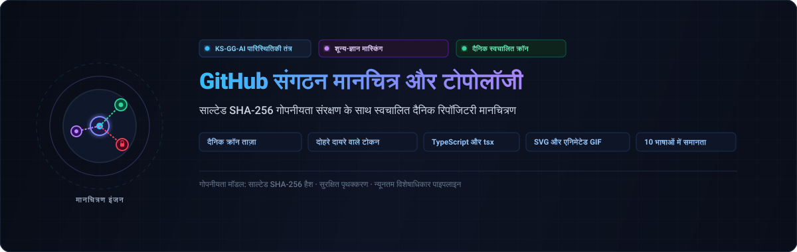

<div align="center">

<p>
  
</p>

# github-org-map

<p>
  <strong>शून्य-ज्ञान SHA-256 मास्किंग के साथ KS-SSS-AI रिपॉजिटरी का स्वचालित दैनिक टोपोलॉजी मानचित्रण</strong>
</p>

<p>
  <a href="../../README.md">🇺🇸 English</a> · <a href="./ko.md">🇰🇷 한국어</a> · <a href="./zh-CN.md">🇨🇳 中文</a> · <a href="./es.md">🇪🇸 Español</a> · <strong>🇮🇳 हिन्दी</strong><br />
  <a href="./ar.md">🇸🇦 العربية</a> · <a href="./pt-BR.md">🇧🇷 Português</a> · <a href="./ru.md">🇷🇺 Русский</a> · <a href="./fr.md">🇫🇷 Français</a> · <a href="./id.md">🇮🇩 Bahasa Indonesia</a>
</p>

<p>
  <a href="https://github.com/KS-SSS-AI/github-org-map/releases"></a>
  <a href="../../LICENSE"></a>
  
  
  
</p>

<p align="center">
  
</p>

</div>

---

<details>
<summary><h2 style="display:inline-block; margin:0;">के बारे में</h2></summary>

KS-SSS-AI खाते और KS-SSS-AI संगठन के रिपॉजिटरी का दैनिक अद्यतन मानचित्र। सार्वजनिक रिपॉजिटरी अपने वास्तविक नामों के साथ दिखाई देते हैं; निजी रिपॉजिटरी सुरक्षित नमकीन SHA-256 मास्क के रूप में दिखाई देते हैं। प्रत्येक स्नैपशॉट को `history/` में रखा जाता है और एक एनिमेटेड GIF में संयोजित किया जाता है।

</details>

---

<details>
<summary><h2 style="display:inline-block; margin:0;">यह कैसे काम करता है</h2></summary>

यह रिपॉजिटरी दैनिक रूप से मानचित्र उत्पन्न करती है: आज का SVG स्नैपशॉट, कालानुक्रमिक इतिहास, और समय के साथ बदलाव दिखाने वाला एनिमेटेड GIF।

</details>

---

<details>
<summary><h2 style="display:inline-block; margin:0;">आवश्यक सीक्रेट्स (Secrets)</h2></summary>

सुरक्षित निष्पादन के लिए `USER_READ_TOKEN`, `ORG_READ_TOKEN`, और `MASK_SALT` की आवश्यकता होती है।

</details>

---

<details>
<summary><h2 style="display:inline-block; margin:0;">अनुसूची (Schedule)</h2></summary>

दैनिक स्वचालित शेड्यूलिंग और पृथक GitHub Actions नौकरियों के साथ सुरक्षित निष्पादन।

</details>

---

<details>
<summary><h2 style="display:inline-block; margin:0;">स्थानीय निष्पादन</h2></summary>

```sh
npm install
USER_READ_TOKEN=ghp_xxx ORG_READ_TOKEN=ghp_yyy MASK_SALT=<the salt> npm run generate
```

</details>

---

<details>
<summary><h2 style="display:inline-block; margin:0;">कॉन्फ़िगरेशन</h2></summary>

`data/config.json` को संपादित करके संगठन, समयक्षेत्र और GIF सेटिंग्स को अनुकूलित करें।

</details>

---

<details>
<summary><h2 style="display:inline-block; margin:0;">परीक्षण</h2></summary>

```sh
npm test
```

</details>

---

<details>
<summary><h2 style="display:inline-block; margin:0;">📬 संपर्क</h2></summary>

सार्वजनिक कार्य, फ़ीडबैक या कार्यान्वयन को करीब से देखने के लिए ये सबसे स्पष्ट शुरुआती बिंदु हैं।

[GitHub प्रोफ़ाइल](https://github.com/KS-SSS-AI) · [सार्वजनिक रिपॉजिटरी](https://github.com/KS-SSS-AI?tab=repositories) · [समस्या दर्ज करें](https://github.com/KS-SSS-AI/github-org-map/issues/new) · [प्रोफ़ाइल स्रोत](https://github.com/KS-SSS-AI/KS-SSS-AI)

</details>
