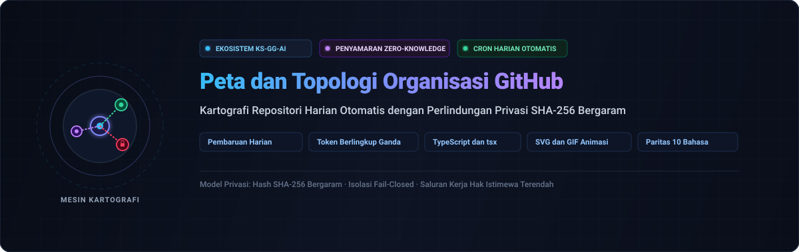

<div align="center">

<p>
  
</p>

# github-org-map

<p>
  <strong>Pemetaan topologi harian repositori KS-SSS-AI otomatis dengan penyembunyian privasi SHA-256 tanpa pengetahuan</strong>
</p>

<p>
  <a href="../../README.md">🇺🇸 English</a> · <a href="./ko.md">🇰🇷 한국어</a> · <a href="./zh-CN.md">🇨🇳 中文</a> · <a href="./es.md">🇪🇸 Español</a> · <a href="./hi.md">🇮🇳 हिन्दी</a><br />
  <a href="./ar.md">🇸🇦 العربية</a> · <a href="./pt-BR.md">🇧🇷 Português</a> · <a href="./ru.md">🇷🇺 Русский</a> · <a href="./fr.md">🇫🇷 Français</a> · <strong>🇮🇩 Bahasa Indonesia</strong>
</p>

<p>
  <a href="https://github.com/KS-SSS-AI/github-org-map/releases"></a>
  <a href="../../LICENSE"></a>
  
  
  
</p>

<p align="center">
  
</p>

</div>

---

<details>
<summary><h2 style="display:inline-block; margin:0;">Tentang</h2></summary>

Peta repositori milik akun KS-SSS-AI dan organisasi KS-SSS-AI yang diperbarui setiap hari. Repositori publik ditampilkan dengan nama aslinya; repositori privat disamarkan dengan hash SHA-256 yang aman. Snapshot harian disimpan di `history/` dan digabungkan menjadi GIF animasi.

</details>

---

<details>
<summary><h2 style="display:inline-block; margin:0;">Cara kerja</h2></summary>

Repositori ini menghasilkan peta secara mandiri: snapshot SVG hari ini, arsip riwayat, dan GIF animasi yang memperlihatkan evolusi struktur.

</details>

---

<details>
<summary><h2 style="display:inline-block; margin:0;">Rahasia yang diperlukan (Secrets)</h2></summary>

Memerlukan `USER_READ_TOKEN`, `ORG_READ_TOKEN`, dan `MASK_SALT` untuk isolasi data yang aman.

</details>

---

<details>
<summary><h2 style="display:inline-block; margin:0;">Jadwal dan Otomatisasi</h2></summary>

Berjalan otomatis setiap hari menggunakan alur kerja GitHub Actions dengan dua pekerjaan terpisah.

</details>

---

<details>
<summary><h2 style="display:inline-block; margin:0;">Menjalankan secara lokal</h2></summary>

```sh
npm install
USER_READ_TOKEN=ghp_xxx ORG_READ_TOKEN=ghp_yyy MASK_SALT=<the salt> npm run generate
```

</details>

---

<details>
<summary><h2 style="display:inline-block; margin:0;">Konfigurasi</h2></summary>

Edit `data/config.json` untuk mengubah akun, organisasi, zona waktu, atau parameter GIF.

</details>

---

<details>
<summary><h2 style="display:inline-block; margin:0;">Pengujian</h2></summary>

```sh
npm test
```

</details>

---

<details>
<summary><h2 style="display:inline-block; margin:0;">Kontak</h2></summary>

Untuk pertanyaan, masukan, atau ide, silakan gunakan tautan resmi di bawah ini.

[GitHub 프로필](https://github.com/KS-SSS-AI) · [프로필 저장소](https://github.com/KS-SSS-AI/KS-SSS-AI) · [이슈 등록](https://github.com/KS-SSS-AI/KS-SSS-AI/issues/new)

</details>

---

<details>
<summary><h2 style="display:inline-block; margin:0;">📬 Kontak</h2></summary>

Untuk pekerjaan publik, masukan, atau melihat implementasi lebih dekat, tautan berikut adalah titik awal yang paling jelas.

[Profil GitHub](https://github.com/KS-SSS-AI) · [Repositori publik](https://github.com/KS-SSS-AI?tab=repositories) · [Buka issue](https://github.com/KS-SSS-AI/github-org-map/issues/new) · [Sumber profil](https://github.com/KS-SSS-AI/KS-SSS-AI)

</details>
