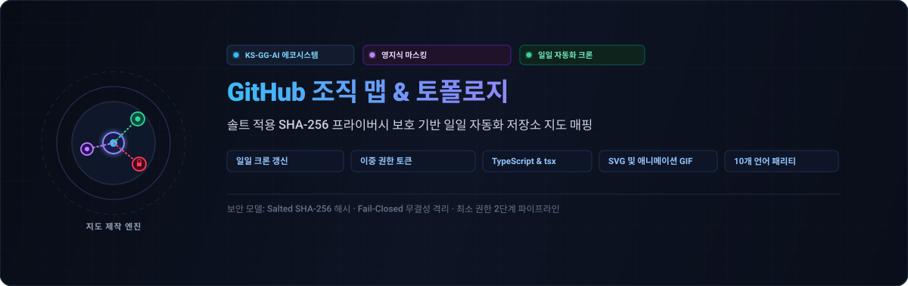
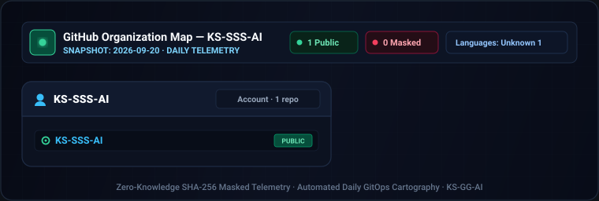

<div align="center">

<p>
  
</p>

# github-org-map

<p>
  <strong>KS-SSS-AI 계정 및 조직 저장소의 영지식(Zero-Knowledge) SHA-256 마스킹 기반 일일 자동화 지도 및 토폴로지 매핑</strong>
</p>

<p>
  <a href="../../README.md">🇺🇸 English</a> · <strong>🇰🇷 한국어</strong> · <a href="./zh-CN.md">🇨🇳 中文</a> · <a href="./es.md">🇪🇸 Español</a> · <a href="./hi.md">🇮🇳 हिन्दी</a><br />
  <a href="./ar.md">🇸🇦 العربية</a> · <a href="./pt-BR.md">🇧🇷 Português</a> · <a href="./ru.md">🇷🇺 Русский</a> · <a href="./fr.md">🇫🇷 Français</a> · <a href="./id.md">🇮🇩 Bahasa Indonesia</a>
</p>

<p>
  <a href="https://github.com/KS-SSS-AI/github-org-map/releases"></a>
  <a href="../../LICENSE"></a>
  
  
  
</p>

<p align="center">
  
</p>

</div>

---

<details>
<summary><h2 style="display:inline-block; margin:0;">소개</h2></summary>

KS-SSS-AI 계정과 KS-SSS-AI 조직이 소유한 저장소를 매일 갱신해 보여주는 지도입니다. 공개 저장소는 실제 이름으로, 비공개 저장소는 솔트(Salt) 기반 SHA-256 해시로 마스킹된 안전한 라벨로만 표시되며 일부 저장소는 지도에서 안전하게 제외됩니다. 날짜별 스냅샷은 `history/`에 영구 보존되고, 이를 연결한 애니메이션 GIF로 조직 구조의 변화를 시각적으로 추적할 수 있습니다.

</details>

---

<details>
<summary><h2 style="display:inline-block; margin:0;">작동 원리</h2></summary>

본 저장소는 매일 자체적으로 저장소 지도를 생성합니다:
- **오늘의 SVG 스냅샷**: 계정 및 조직별 상태를 반영한 다크 섀시 벡터 지도.
- **날짜별 히스토리 아카이브**: `history/<date>.svg` 형태로 축적되는 과거 스냅샷.
- **애니메이션 GIF 타임랩스**: 축적된 히스토리를 합성하여 저장소 지도의 시계열 변화를 보여주는 `org-map.gif`.

가시성이 비공개인 모든 저장소는 이름이 마스킹된 라벨로 대체되며, 공개 저장소는 이미 GitHub에 공개된 정보이므로 본래 명칭이 그대로 유지됩니다. 특정 내부 저장소는 설정에 따라 맵에서 완전히 제외됩니다.

</details>

---

<details>
<summary><h2 style="display:inline-block; margin:0;">필수 시크릿 (Required Secrets)</h2></summary>

세분화된 개인 접근 토큰(Fine-Grained PAT)은 리소스 소유자가 정확히 1곳으로 제한되므로, 단일 토큰으로 계정 저장소와 조직 저장소를 동시에 조회할 수 없습니다. 따라서 워크플로 실행을 위해 다음 3개의 시크릿이 필요합니다:

- `USER_READ_TOKEN`: 리소스 소유자가 추적 대상 계정으로 지정되고, **All repositories** 접근 및 **Metadata** 읽기 전용 권한을 가진 세분화 토큰 (비공개 저장소를 포함한 계정 저장소 목록 조회용).
- `ORG_READ_TOKEN`: 리소스 소유자가 추적 대상 조직으로 지정되고, 동일한 **All repositories** 접근 및 **Metadata** 읽기 전용 권한을 가진 세분화 토큰 (조직 저장소 목록 조회용).
- `MASK_SALT`: 마스킹 해시 생성에 사용되는 무작위 비밀 솔트(Salt) 문자열. 필수 항목이며 누락 시 작업이 즉시 중단(Fail-closed)됩니다.

두 GitHub 토큰은 환경 변수를 통해서만 제너레이터에 안전하게 전달되며, 명령줄에 직접 노출되지 않습니다.

</details>

---

<details>
<summary><h2 style="display:inline-block; margin:0;">스케줄 및 GitHub Actions 워크플로</h2></summary>

`.github/workflows/refresh.yml`은 매일 정해진 스케줄 및 `workflow_dispatch` 수동 트리거로 실행됩니다. GitHub 읽기 자격증명과 본 저장소 푸시 자격증명이 동일한 작업 공간에 공존하지 않도록 2개의 분리된 작업(Job)으로 엄격히 격리됩니다:

- **`generate`** (`contents: read`, 시크릿 `USER_READ_TOKEN`, `ORG_READ_TOKEN`, `MASK_SALT` 보유): 현재 리포지토리 목록을 조회하고, 단위 테스트를 실행한 뒤, 오늘의 SVG를 렌더링하고 `history/`에 추가하며, `org-map.gif`를 다시 빌드하여 워크플로 아티팩트로 업로드합니다. 이 작업은 본 저장소에 대한 푸시 권한이 없습니다.
- **`commit`** (`contents: write`, 시크릿 미보유): 생성된 아티팩트를 다운로드하여 변경 사항이 있을 때만 커밋 및 푸시합니다. 상기 시크릿에는 일절 접근할 수 없습니다.

</details>

---

<details>
<summary><h2 style="display:inline-block; margin:0;">로컬 실행 방법</h2></summary>

```sh
npm install
USER_READ_TOKEN=ghp_xxx ORG_READ_TOKEN=ghp_yyy MASK_SALT=<the salt> npm run generate
```

</details>

---

<details>
<summary><h2 style="display:inline-block; margin:0;">설정 (Configuration)</h2></summary>

`data/config.json`을 수정하여 추적할 계정, 조직 목록, 타임존, 또는 GIF 애니메이션 타이밍(`frameMs`, `lastFrameMs`, `maxFrames`)을 변경할 수 있습니다.

`tokenEnv`는 소유자 로그인(계정 또는 조직명)을 해당 소유자의 토큰을 담은 환경 변수 이름으로 매핑합니다. 설정이 없는 소유자는 기본값인 `ORG_READ_TOKEN`을 거쳐 `GITHUB_TOKEN`으로 폴백됩니다.

</details>

---

<details>
<summary><h2 style="display:inline-block; margin:0;">테스트 실행</h2></summary>

```sh
npm test
```

</details>

---

<details>
<summary><h2 style="display:inline-block; margin:0;">문의 및 피드백</h2></summary>

지도에 대한 질문, 피드백, 기능 제안은 아래 공식 채널을 통해 전달해 주시기 바랍니다.

[GitHub 프로필](https://github.com/KS-SSS-AI) · [프로필 저장소](https://github.com/KS-SSS-AI/KS-SSS-AI) · [이슈 등록](https://github.com/KS-SSS-AI/KS-SSS-AI/issues/new)

</details>

---

<details>
<summary><h2 style="display:inline-block; margin:0;">📬 연락</h2></summary>

공개 작업, 피드백, 구현 내용을 더 살펴보려면 아래 경로가 가장 빠릅니다.

[GitHub 프로필](https://github.com/KS-SSS-AI) · [공개 저장소](https://github.com/KS-SSS-AI?tab=repositories) · [이슈 열기](https://github.com/KS-SSS-AI/github-org-map/issues/new) · [프로필 소스](https://github.com/KS-SSS-AI/KS-SSS-AI)

</details>
