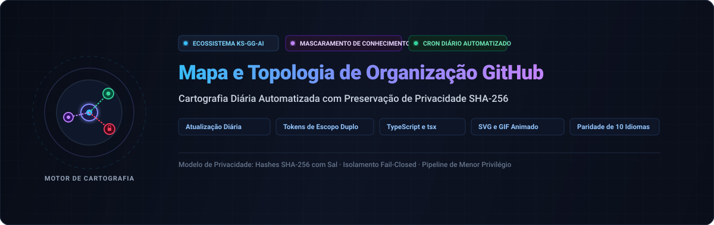

<div align="center">

<p>
  
</p>

# github-org-map

<p>
  <strong>Mapeamento topológico diário automatizado de repositórios KS-SSS-AI com mascaramento seguro SHA-256 de conhecimento zero</strong>
</p>

<p>
  <a href="../../README.md">🇺🇸 English</a> · <a href="./ko.md">🇰🇷 한국어</a> · <a href="./zh-CN.md">🇨🇳 中文</a> · <a href="./es.md">🇪🇸 Español</a> · <a href="./hi.md">🇮🇳 हिन्दी</a><br />
  <a href="./ar.md">🇸🇦 العربية</a> · <strong>🇧🇷 Português</strong> · <a href="./ru.md">🇷🇺 Русский</a> · <a href="./fr.md">🇫🇷 Français</a> · <a href="./id.md">🇮🇩 Bahasa Indonesia</a>
</p>

<p>
  <a href="https://github.com/KS-SSS-AI/github-org-map/releases"></a>
  <a href="../../LICENSE"></a>
  
  
  
</p>

<p align="center">
  
</p>

</div>

---

<details>
<summary><h2 style="display:inline-block; margin:0;">Sobre</h2></summary>

Um mapa atualizado diariamente dos repositórios pertencentes à conta KS-SSS-AI e à organização KS-SSS-AI. Repositórios públicos aparecem com seus nomes reais; repositórios privados aparecem mascarados com hash SHA-256 seguro, e alguns repositórios são totalmente omitidos. Cada instantâneo diário é preservado em `history/` e compilado em um GIF animado.

</details>

---

<details>
<summary><h2 style="display:inline-block; margin:0;">Como funciona</h2></summary>

Este repositório gera o mapa diariamente: instantâneo SVG do dia, histórico em `history/<date>.svg` e GIF animado `org-map.gif`.

</details>

---

<details>
<summary><h2 style="display:inline-block; margin:0;">Segredos necessários</h2></summary>

Tokens de acesso dedicados (`USER_READ_TOKEN`, `ORG_READ_TOKEN`) e `MASK_SALT` para anonimização com falha fechada.

</details>

---

<details>
<summary><h2 style="display:inline-block; margin:0;">Agendamento e CI/CD</h2></summary>

Execução diária com fluxo de trabalho dividido em dois jobs isolados para segurança máxima de credenciais.

</details>

---

<details>
<summary><h2 style="display:inline-block; margin:0;">Execução local</h2></summary>

```sh
npm install
USER_READ_TOKEN=ghp_xxx ORG_READ_TOKEN=ghp_yyy MASK_SALT=<the salt> npm run generate
```

</details>

---

<details>
<summary><h2 style="display:inline-block; margin:0;">Configuração</h2></summary>

Edite `data/config.json` para ajustar contas rastreadas, fuso horário e parâmetros de GIF.

</details>

---

<details>
<summary><h2 style="display:inline-block; margin:0;">Testes</h2></summary>

```sh
npm test
```

</details>

---

<details>
<summary><h2 style="display:inline-block; margin:0;">Contato</h2></summary>

Para perguntas, comentários ou sugestões, utilize os links oficiais abaixo.

[GitHub 프로필](https://github.com/KS-SSS-AI) · [프로필 저장소](https://github.com/KS-SSS-AI/KS-SSS-AI) · [이슈 등록](https://github.com/KS-SSS-AI/KS-SSS-AI/issues/new)

</details>

---

<details>
<summary><h2 style="display:inline-block; margin:0;">📬 Contato</h2></summary>

Para trabalhos públicos, feedback ou uma olhada mais detalhada na implementação, estes são os pontos de partida mais diretos.

[Perfil do GitHub](https://github.com/KS-SSS-AI) · [Repositórios públicos](https://github.com/KS-SSS-AI?tab=repositories) · [Abrir uma issue](https://github.com/KS-SSS-AI/github-org-map/issues/new) · [Código-fonte do perfil](https://github.com/KS-SSS-AI/KS-SSS-AI)

</details>
