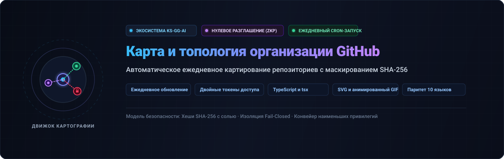

<div align="center">

<p>
  
</p>

# github-org-map

<p>
  <strong>Ежедневное автоматическое картографирование репозиториев KS-SSS-AI с маскированием приватности на базе SHA-256 с нулевым разглашением</strong>
</p>

<p>
  <a href="../../README.md">🇺🇸 English</a> · <a href="./ko.md">🇰🇷 한국어</a> · <a href="./zh-CN.md">🇨🇳 中文</a> · <a href="./es.md">🇪🇸 Español</a> · <a href="./hi.md">🇮🇳 हिन्दी</a><br />
  <a href="./ar.md">🇸🇦 العربية</a> · <a href="./pt-BR.md">🇧🇷 Português</a> · <strong>🇷🇺 Русский</strong> · <a href="./fr.md">🇫🇷 Français</a> · <a href="./id.md">🇮🇩 Bahasa Indonesia</a>
</p>

<p>
  <a href="https://github.com/KS-SSS-AI/github-org-map/releases"></a>
  <a href="../../LICENSE"></a>
  
  
  
</p>

<p align="center">
  
</p>

</div>

---

<details>
<summary><h2 style="display:inline-block; margin:0;">О проекте</h2></summary>

Ежедневно обновляемая карта репозиториев учетной записи KS-SSS-AI и организации KS-SSS-AI. Публичные репозитории отображаются под своими реальными именами; приватные репозитории маскируются безопасным хешем SHA-256 с солью. Снимки сохраняются в `history/` и объединяются в анимированный GIF.

</details>

---

<details>
<summary><h2 style="display:inline-block; margin:0;">Как это работает</h2></summary>

Репозиторий генерирует карту автоматически: векторный снимок SVG на сегодня, датированный архив истории и анимированный GIF `org-map.gif`.

</details>

---

<details>
<summary><h2 style="display:inline-block; margin:0;">Необходимые секреты</h2></summary>

Для работы требуются `USER_READ_TOKEN`, `ORG_READ_TOKEN` и закрытая соль `MASK_SALT`.

</details>

---

<details>
<summary><h2 style="display:inline-block; margin:0;">Расписание и автоматизация</h2></summary>

Рабочий процесс GitHub Actions разделен на два изолированных задания: безопасная генерация и фиксация изменений.

</details>

---

<details>
<summary><h2 style="display:inline-block; margin:0;">Локальный запуск</h2></summary>

```sh
npm install
USER_READ_TOKEN=ghp_xxx ORG_READ_TOKEN=ghp_yyy MASK_SALT=<the salt> npm run generate
```

</details>

---

<details>
<summary><h2 style="display:inline-block; margin:0;">Конфигурация</h2></summary>

Редактируйте `data/config.json` для настройки учетных записей, организаций и параметров GIF.

</details>

---

<details>
<summary><h2 style="display:inline-block; margin:0;">Тестирование</h2></summary>

```sh
npm test
```

</details>

---

<details>
<summary><h2 style="display:inline-block; margin:0;">Контакты и обратная связь</h2></summary>

По всем вопросам и предложениям обращайтесь по официальным ссылкам ниже.

[GitHub 프로필](https://github.com/KS-SSS-AI) · [프로필 저장소](https://github.com/KS-SSS-AI/KS-SSS-AI) · [이슈 등록](https://github.com/KS-SSS-AI/KS-SSS-AI/issues/new)

</details>

---

<details>
<summary><h2 style="display:inline-block; margin:0;">📬 Контакты</h2></summary>

Для вопросов по публичным проектам, обратной связи или детального ознакомления с реализацией лучше всего использовать эти ссылки.

[Профиль GitHub](https://github.com/KS-SSS-AI) · [Публичные репозитории](https://github.com/KS-SSS-AI?tab=repositories) · [Создать issue](https://github.com/KS-SSS-AI/github-org-map/issues/new) · [Исходный код профиля](https://github.com/KS-SSS-AI/KS-SSS-AI)

</details>
