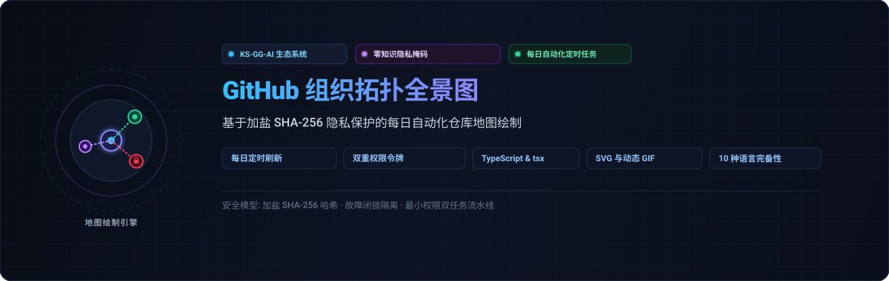

<div align="center">

<p>
  
</p>

# github-org-map

<p>
  <strong>基于零知识 SHA-256 掩码的 KS-SSS-AI 仓库拓扑与组织图谱自动日常生成系统</strong>
</p>

<p>
  <a href="../../README.md">🇺🇸 English</a> · <a href="./ko.md">🇰🇷 한국어</a> · <strong>🇨🇳 中文</strong> · <a href="./es.md">🇪🇸 Español</a> · <a href="./hi.md">🇮🇳 हिन्दी</a><br />
  <a href="./ar.md">🇸🇦 العربية</a> · <a href="./pt-BR.md">🇧🇷 Português</a> · <a href="./ru.md">🇷🇺 Русский</a> · <a href="./fr.md">🇫🇷 Français</a> · <a href="./id.md">🇮🇩 Bahasa Indonesia</a>
</p>

<p>
  <a href="https://github.com/KS-SSS-AI/github-org-map/releases"></a>
  <a href="../../LICENSE"></a>
  
  
  
</p>

<p align="center">
  
</p>

</div>

---

<details>
<summary><h2 style="display:inline-block; margin:0;">关于项目</h2></summary>

本项目每日定时自动生成 KS-SSS-AI 账户和 KS-SSS-AI 组织所拥有的存储库图谱。公开仓库显示其实际名称；私有仓库仅显示为经过盐化 SHA-256 哈希处理的安全掩码标签，部分内部仓库会被完全排除。每日快照保存在 `history/` 中，并合成动图 GIF 直观展示随时间推移的架构演变。

</details>

---

<details>
<summary><h2 style="display:inline-block; margin:0;">工作原理</h2></summary>

本仓库每日自动完成组织图谱的测绘与生成：
- **今日 SVG 快照**：反映账户与组织最新状态的暗色机架风格矢量图。
- **历史快照归档**：以 `history/<date>.svg` 格式持久化保存的历史记录。
- **动态 GIF 时间流**：由历史快照拼接生成的 `org-map.gif`，直观呈现存储库结构的历史演变。

私有仓库的名称均由不可逆的安全掩码替换，公开仓库则保留原始名称。配置中指定的排除项不会在图谱中出现。

</details>

---

<details>
<summary><h2 style="display:inline-block; margin:0;">所需密钥配置</h2></summary>

细粒度个人访问令牌（Fine-Grained PAT）仅能绑定单一资源所有者，单个令牌无法跨账户和组织同时读取。因此工作流需要以下 3 个密钥：

- `USER_READ_TOKEN`：资源所有者设置为被追踪账户，拥有 **All repositories** 访问权限和 **Metadata** 只读权限。
- `ORG_READ_TOKEN`：资源所有者设置为被追踪组织，拥有相同的访问与只读权限。
- `MASK_SALT`：用于掩码哈希加盐的私有随机字符串。必填项，缺失时自动失败终止（Fail-closed）。

</details>

---

<details>
<summary><h2 style="display:inline-block; margin:0;">定时任务与工作流调度</h2></summary>

`.github/workflows/refresh.yml` 每天按计划自动运行，亦支持手动触发。为确保凭据安全，工作流严格拆分为两个独立的作业（Job）：

- **`generate`**：读取 GitHub 数据、运行测试、渲染今日 SVG、归档历史并生成 GIF，最后上传产物。无代码推送权限。
- **`commit`**：下载构建产物，并在有变动时提交并推送到本仓库。完全不接触任何上游访问令牌。

</details>

---

<details>
<summary><h2 style="display:inline-block; margin:0;">本地运行方式</h2></summary>

```sh
npm install
USER_READ_TOKEN=ghp_xxx ORG_READ_TOKEN=ghp_yyy MASK_SALT=<the salt> npm run generate
```

</details>

---

<details>
<summary><h2 style="display:inline-block; margin:0;">配置说明</h2></summary>

编辑 `data/config.json` 可修改跟踪的账户、组织、时区以及 GIF 帧率参数（`frameMs`, `lastFrameMs`, `maxFrames`）。

</details>

---

<details>
<summary><h2 style="display:inline-block; margin:0;">测试执行</h2></summary>

```sh
npm test
```

</details>

---

<details>
<summary><h2 style="display:inline-block; margin:0;">📬 联系</h2></summary>

对于公开工作、反馈或深入了解实现细节，这些是最直接的入口。

[GitHub 个人主页](https://github.com/KS-SSS-AI) · [公开仓库](https://github.com/KS-SSS-AI?tab=repositories) · [提交 Issue](https://github.com/KS-SSS-AI/github-org-map/issues/new) · [个人主页源码](https://github.com/KS-SSS-AI/KS-SSS-AI)

</details>
